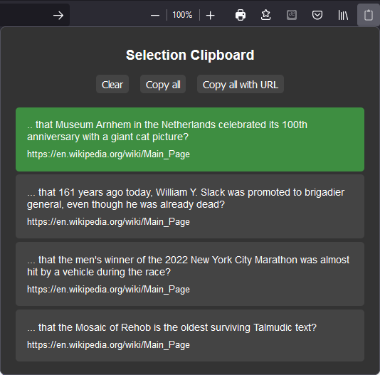

# Selection Clipboard (Firefox extension)

This extension adds a different text clipboard functionality to Firefox.
By selecting a text, the selected text is copied to the clipboard immediately and
added to the extension's selection history. 

The selection history can be accessed by clicking the extension's icon in
the toolbar. You can select a text from the history to copy it to the clipboard.

## Installation

The extension is not signed and still in development stage.
- Clone the repository.
- Open **Firefox** and enter `about:debugging#/runtime/this-firefox` in the address bar.
- Click on **Load Temporary Add-on...**.
- Navigate to the extension's directory and select the `manifest.json` file.

If the extension's icon is not visible in the toolbar:
- Click on the **Extensions** button in the toolbar.
- Select the **Preferences** button next to the **Selection Clipboard** entry in the list of extensions.
- Click on the **Show in Toolbar** button.

If you want to install the extension permanently, you can use the
[**web-ext**][1] tool to sign the extension.

[1]: https://github.com/mozilla/web-ext

## Screenshot

